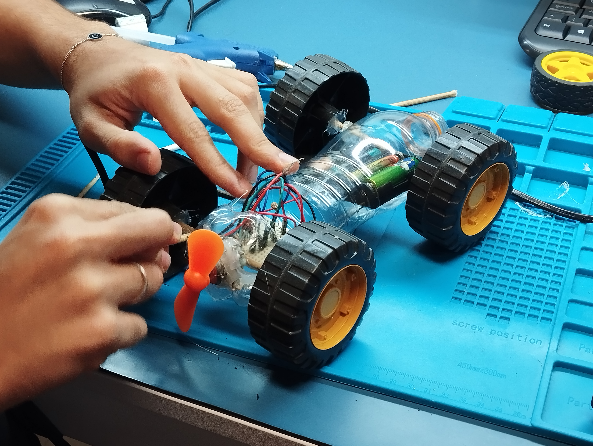
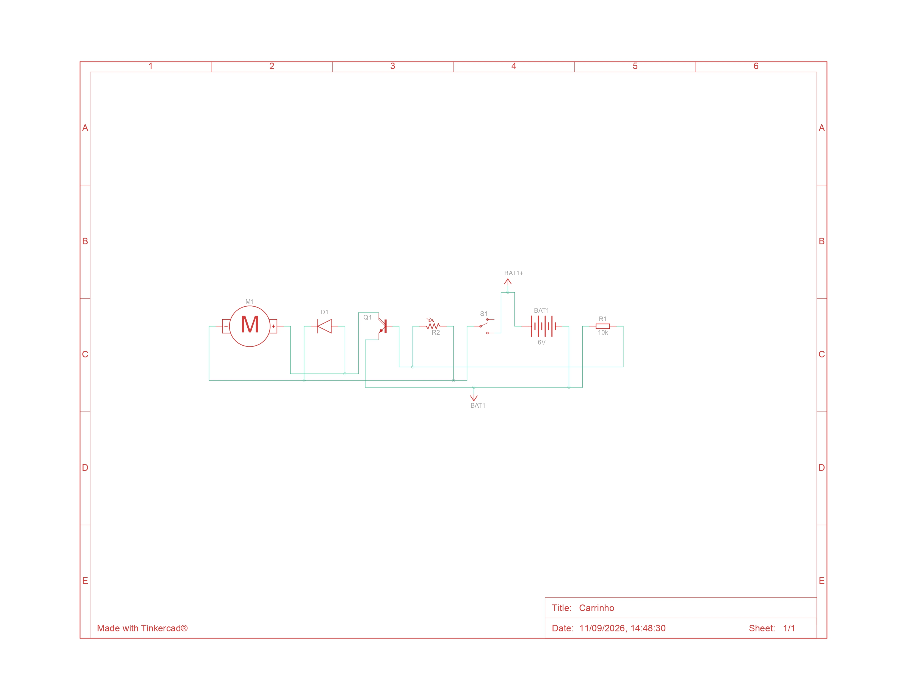
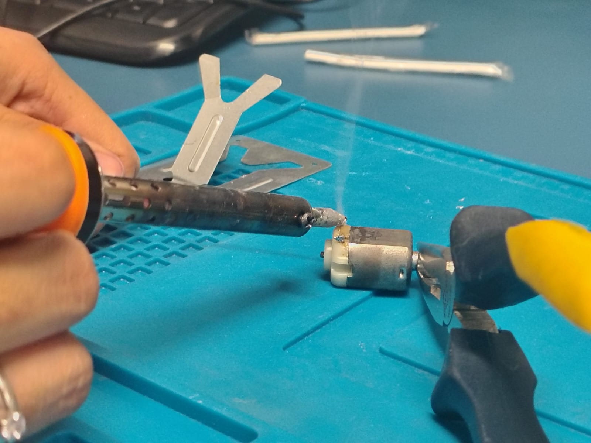
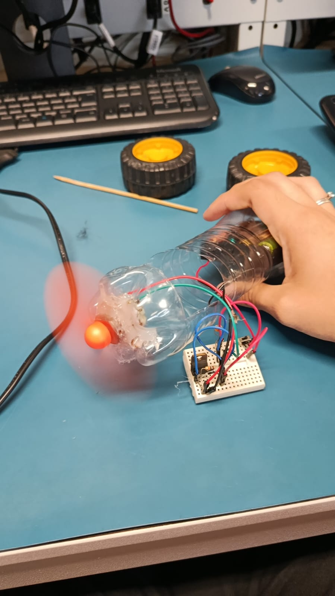

# Carrinho Mecatrônico
Neste projeto você vai aprender a montar seu próprio carrinho de sucata movido a hélice motorizada!

Bora lá?

## Autores 
- Gabriel
- Giovana
- Lucas
- Vinícius

---

Abaixo você pode consultar o nosso simulador, lista de materiais e o sistema elétrico.

## Simulador do projeto
[simulador](https://www.tinkercad.com/things/9brm5vtV3ye-carrinho?sharecode=BGr5bC6jahYDKuxjPoimQTSfGVvUH84h-n3euFHXYH4)

---

## Materiais do projeto

| Nome | Quantidade | Componente |
|---|---:|---|
| R1 | 1 | 10 kΩ Resistor |
| D1 | 1 | Diodo |
| S1 | 1 | Interruptor deslizante |
| R2 | 1 | Fotorresistor |
| M1 | 1 | Motor CC |
| Bat1 | 1 | 4 baterias AA, não Bateria 1,5V |
| 1 | 1 | Placa de ensaio mini |
| Q1 | 1 | TIP120 |

---

## Esquema elétrico do projeto

---

## Acompanhe nossa montagem!

---

## Aplicando estanho nos pontos de fixação de cabo no motor!

## Preparando abertura para acoplar o motor!

## Sucesso!

## Rodinhas colocadas, nosso carrinho está pronto!

